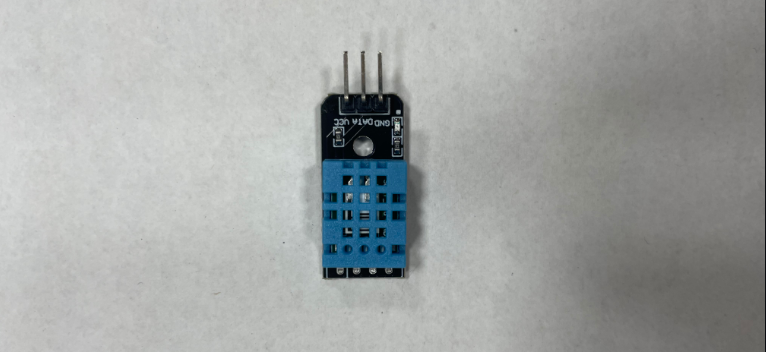
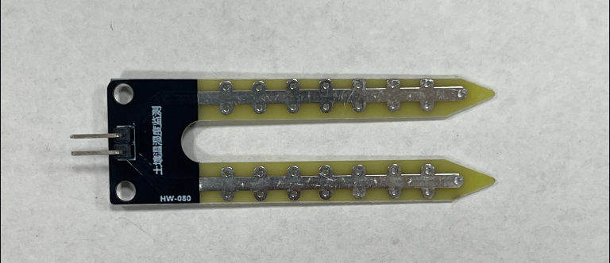
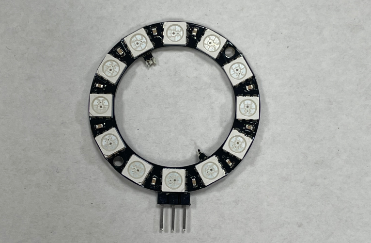
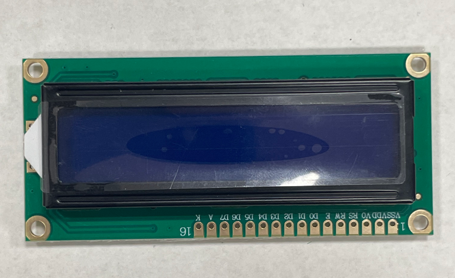

# SmartFarm---Arduino-IDE
스마트팜 아두이노 개발 (하드웨어)

## day01
- 
- 아두이노 IDE 설정   
    - 아두이노 IDE 설치  
    - 보드 매니저에서 ESP32 보드 추가 
    - 예제 코드 업로드 : 파일 > 예제 > ESP32 > Camera > CameraWebServer
    - 카메라 핀 설정 #define CAMERA_MODEL_AI_THINKER
    - Wi-Fi 설정 : 예제 코드에서 사용할 Wi-Fi SSID와 패스워드를 입력
        - ex : const char* ssid = "와이파이 이름";
        - ex : const chsar* password : "비밀번호";
    - 코드 업로드 
        - 도구 업로드 속도 1152000으로 설정 
        - 업로드 버튼을 누르고 코드 업로드 
    - 웹캠 스트리밍 확인
        - 시리얼 모니터 열기
            - 업로드가 완료된 후 , 도구 > 시리얼 모니터 , 115200 baud로 설정
            - 시리얼 모니터에서 ESP32-CAM의 IP주소 확인
    - 웹 브라우저 스트리밍 확인
            - 웹 브라우저에 시리얼 모니터에서 확인한 IP주소를 입력 
            - http://아이피:포트
            - 웹 페이지 스트리밍 확인

- 
- 공유기 기본 게이트위이 접속(http://192.168.5.1)으로 접속
    - 로그인 진행
        - 관리 로그인
    - 포트포워드 관리
        - 외부에서도 사용할 수 있게 외부포트 번호를 설정해줌 
    - LAN 연결 정보에서 범위를 변경
        - **공유기 상태 정보창에 나와있는 서브넷 마스크를 가져와서 사용**
        - IPAddress local_IP(172 , 30, 1, 5); //고정 아이피 
        - IPAddress gateway(172 , 30, 1, 254); //공유기 관리 주소
        - IPAddress subnet(255, 255, 255, 0); //서브넷 마크
        ```python 
        void setup() #부분에 추가
        if(!WiFi.config(local_IP, gateway, subnet)) {
            Serial.println("STA Failed to configure");
        }
        ```
        **추가해야 고정아이피 설정이 끝이 남**
- 공유기 상태 정보에서 인터넷 연결 정보의 ip 주소(외부 아이피)를 복사 후
    - 인터넷 창에 http://외부아이피:포트/mjpeg/1
    - 영상의 경우: http://외부아이피:포트/mjpeg/1
    - 사진의 경우: http://외부아이피:포트/jpg

## 센서
1. 센서 확장 쉴드
    - 우노 메가, 듀에 등에 적층하여 사용하는 확장형 쉴드로, 센서들을 확장하여 사용하는 용도로 사용
    - V5.0은 통신선과 LCD 인터페이스, 특히 RGB 3색으로 표현하는 그래픽 12864LCD를 확장할 수 있는 인터페이스가 추가되었으며 SD카드를 이용해 메모리를 확장할 수도 있음
    
    

2. 쿨링 팬(Cooling Fan)
    - DC Fan이란 DC모터를 사용하여 동작시키는 Fan으로 (+)단자와 (-)단자에 충분한 전원을 인가하여 동작시킬 수 있으며, PWM방식으로 속도를 제어할 수 있음
    - 일반적으로 컴퓨터 내부에서 돌고 있는 쿨링 팬과 여름에 많이 사용하는 손 선풍기 등으로 사용되며 주로 전자기기에서 발생하는 열을 식히기 위한 쿨링 장치로 많이 사용
    

3. 온·습도 센서 (DHT11)
    - 정전식 습도 센서와 서미스터를 사용하여 대기 온도와 습도를 측정하고 디지털 신호로 출력하는 센서
    - 정전식 습도 센서는 습도에 따라 저항 값이 변함
    - 서미스터는 온도에 따라 저항 값이 변하는 소자
    - 온도를 감지하는 부분은 세라믹 반도체로 이루어져, 온도에 따라 물질의 저항 값이 변하는 소재의 특성을 이용하여 값의 변화를 감지해 온도 값을 출력
    - 습도는 두 전극 사이의 저항 변화를 측정함으로써, 공기 중의 습도 변화를 알아낼 수 있음
    

4. 토양수분 감지 모듈
    - 화분과 같은 토양이 담긴 용기에 매립하여 토양의 수분량을 측정할 수 있는 센서
    - 토양 내 수분함량이 적으면 저항 값이 커지면서 전류가 잘 흐르지 않고, 반대로 수분 함량이 많으면 저항 값이 작아지면서 전류가 잘 흐름
    - 토양 내 수분함량이 매우 많을 떄는 저항이 둔감하여 오차가 커짐
    

5. 네오픽셀 RGB LED
    - 하나의 신호선으로 점멸, 밝기, 색상의 변화를 제어할 수 있는 구동칩이 내장된 LED모듈
    - RGB LED는 다른 조명들에 비해 가격이 비싸지만 밝고, 수명이 길다는 장점이 있음
    - LED는 원형, 사각형 등 다양한 모양의 제품이 존재하며 우리 조는 12개의 LED가 원형으로 배치된 제품을 사용
    - RGB LED는 프로그래밍 할 떄 0~11번으로 순서번호가 바뀌기 떄문에 주의하며 제어해야 함
    
    - 빛의 삼원색(RGB)
        - 빛의 삼원색은 혼합할수록 밝아짐
        - 빨강(Red), 초록(Greed), 파랑(Blue) 값을 이용하여 여러가지 색상을 출력함
        - 각 색상 값의 범위는 0~255 값을 가지며, 색상 값을 이용해 여러가지 색상을 만들 수 있음

6. LCD(l2C) 디스플레이 모듈
    - LCD는 글자나 숫자를 표현할 수 있는 표시장치
    - 액정 표시 장치는 액체처럼 유체의 성질을 가지면서 고체처럼 광학적 성질을 가지는 물질로 액체와 고체의 중간 상태인 액정의 전기적 성질을 이용하여 문자를 표시함
    - 1602(16x2) 모델은 가장 보편적인 LCD로 뒷면에 I2C 변환 모듈을 부착하여 단 4개의 핀으로 쉽게 제어를 할 수 있도록 만들어진 모델
    - LCD 디스플레이는 후면에 백라이트를 두고, 전면에 액정을 두어 액정이 전기신호에 따라 빛을 차단하거나 통과시키는 방식으로 빛을 냄
    - 액정의 불규칙한 배열이 빛의 진동 방향을 바꾸어 한번 편광 판에 걸러진 빛이 다음 편광 판을 통과함
    - 백라이트는 액정의 편광 정도를 조절하여 화면의 밝기를 조정
    


## Arduino IDE 코드

1. 사용된 라이브러리
    1. Wire.h
        - 기능 : I2C 통신을 위한 라이브러리
        - 설명: 다른 I2C 장치와 Arduino 간의 데이터 통신을 담당
    ```c
    #include <Wire.h>
    ``` 
    2. LiquidCrystal_I2C.h
        - 기능: LCD 1602를 I2C 인터페이스로 제어하기 위한 라이브러리
        - 설명: 텍스트 및 기호를 LCD에 표시할 수 있음
    ```c
    #include <LiquidCrystal_I2C.h>
    ``` 
    3. Adafruit_NeoPixel.h
        - 기능: Adafruit사의 Neopixel (WS2812) LED를 제어하기 위한 라이브러리
        - 설명: RGB LED의 색상 및 밝기를 제어할 수 있음
     ```c
    #include <Adafruit_NeoPixel.h> 
    ```    
    4. DHT.h
        - 기능: DHT 시리즈(온습도 센서)를 제어하기 위한 라이브러리
        - 설명: 주변 환경의 온도와 습도를 측정할 수 있음
    ```c
    #include "DHT.h"
    ``` 

2. 정의된 상수 및 변수
    1. DHTPIN: DHT 센서의 데이터 핀을 A0로 정의
    ```c
    #define DHTPIN A0
    ``` 
    2. DHTTYPE: 사용할 DHT 센서 종류를 DHT11으로 정의
    ```c
    #define DHTTYPE DHT11
    ```     
    3. JODO_PIN: 주변 광 조도 센서가 연결된 핀을 A2로 정의
    ```c
    #define JODO_PIN A2
    ```     
    4. AA, AB, BA, BB: 모터 A와 B를 제어하기 위한 핀을 각각 5, 4, 6, 7로 설정
    ```c
    int AA = 5;  // 모터 A의 핀
    int AB = 4;  // 모터 A의 핀
    int BA = 6;  // 모터 B의 핀
    int BB = 7;  // 모터 B의 핀
    ``` 
    5. sensorPin: 다른 센서가 연결된 아날로그 핀 번호를 A2로 정의
    ```c
    const int sensorPin = A2;
    ``` 
    6. relayPin: 릴레이 제어 핀을 11로 설정
    ```c
    const int relayPin = 11;
    ```   
    7. 기타 변수
    ```c
    int sensorValue = 0;      // 센서 값 저장 변수
    int ON = 1;               // ON 상태를 나타내는 상수
    int OFF = 0;              // OFF 상태를 나타내는 상수
    const unsigned long motorOnTime = 5000;  // 모터가 켜져 있을 시간 (밀리초)
    const unsigned long motorOffTime = 5000; // 모터가 꺼져 있을 시간 (밀리초)
    unsigned long previousMillis = 0; // 마지막으로 모터 상태가 변경된 시간
    bool motorState = false; // 모터 상태 (켜짐: true, 꺼짐: false)
    int JODO;   // 조도 센서의 값을 저장할 변수
    float fMax_hum = 0.0;   // 습도 센서의 최대 기준값을 저장하는 변수(초기값 0.0)
    float fMax_temp = 0.0;  // 온도 센서의 최대 기준값을 저장하는 변수(초기값 0.0)
    float fMin_temp = 0.0;  // 온도 센서의 최소 기준값을 저장하는 변수(초기값 0.0)
    int Soil_moisture_reference = 0;    // 토양 수분 센서의 기준값을 저장하는 변수
    ```     

3. 객체 및 변수 초기화
    1. dht: DHT 센서 객체를 초기화하고 DHTPIN과 DHTTYPE을 사용하여 설정
    ```c
    DHT dht(DHTPIN, DHTTYPE);
    ```
    2. RGB_LED: Neopixel LED 객체를 초기화하고, 12개의 LED가 연결된 핀 번호 9를 NEO_GRB 방식으로 설정
    ```c
    Adafruit_NeoPixel RGB_LED = Adafruit_NeoPixel(12, 9, NEO_GRB);
    ```    
    3. lcd: LCD 객체를 초기화하고, I2C 주소 0x27을 사용하여 16x2 형식의 LCD를 설정
    ```c
    LiquidCrystal_I2C lcd(0x27, 16, 2);
    ``` 


4. setup() 함수
    1. 릴레이 핀 설정
    ```c
    pinMode(relayPin, OUTPUT); // 릴레이 핀을 출력으로 설정
    ```
    2. 릴레이 초기 상태 설정
    ```c
    digitalWrite(relayPin, LOW); // 릴레이 초기 상태를 꺼짐으로 설정
    ```
    3. 센서 기준값 설정
    ```c
    fMax_hum = 60.0;                            // 습도 센서 기준값 설정
    fMax_temp = 30.0;                           // 최대 온도 기준값 설정
    fMin_temp = 22.0;                           // 최소 온도 기준값 설정
    Soil_moisture_reference = 50;               // 토양 수분 기준값 설정 (0 ~ 100%)
    ```
    4. 주변 광 조도 센서 핀 설정
    ```c
    pinMode(JODO_PIN, INPUT);   // JODO_PIN으로 정의된 핀을 입력 모드로 설정
    ```
    5. 시리얼 통신 설정
    ```c
    Serial.begin(9600);     // 시리얼 통신을 초기화하고, 통신 속도를 9600 baud로 설정
    ```
    6. DHT 센서 초기화
    ```c
    dht.begin(); // DHT 초기화
    ```
    7. LCD 초기화
    ```c
    lcd.init();       // LCD 초기화
    lcd.backlight();  // LCD 백라이트 켜기
    ```
    8. Neopixel LED 초기화
    ```c
    RGB_LED.begin();            // Neopixel 초기화
    RGB_LED.setBrightness(200); // Neopixel 밝기 설정
    RGB_LED.show();             // Neopixel 표시
    ```
    9. 모터 핀 설정
    ```c
    pinMode(AA, OUTPUT);  // 모터 A 핀 설정
    pinMode(AB, OUTPUT);  // 모터 A 핀 설정
    pinMode(BA, OUTPUT);  // 모터 B 핀 설정
    pinMode(BB, OUTPUT);  // 모터 B 핀 설정
    ```

5. loop() 함수
    1. 주기적으로 실행되며, 주요 기능을 수행
    2. 릴레이를 제어하여 일정 시간 동안 모터를 켜고 끄는 작업을 수행
        - 모터가 켜져 있는 상태(motorState == true)
        ```c
        if (motorState) {
            if (currentMillis - previousMillis >= motorOnTime) {
                motorState = false; // 모터 상태를 꺼짐으로 설정
                previousMillis = currentMillis; // 현재 시간을 저장
                digitalWrite(relayPin, LOW); // 릴레이 OFF
            }
        }
        ```
        - 모터가 꺼져 있는 상태(motorState == false)
        ```c
        else {
            if (currentMillis - previousMillis >= motorOffTime) {
                motorState = true; // 모터 상태를 켜짐으로 설정
                previousMillis = currentMillis; // 현재 시간을 저장
                digitalWrite(relayPin, HIGH); // 릴레이 ON
            }
        }
        ```
    3. 다양한 센서 값(온습도, 토양 수분, 주변 광 조도)을 읽어들이고, 시리얼 모니터에 출력
        - 센서 값 읽기와 출력
        ```c
        JODO = analogRead(JODO_PIN);       // 주변 광 조도 센서 값 읽기
        float hum = dht.readHumidity();    // 습도값 읽기
        float temp = dht.readTemperature(); // 온도값 읽기
        int Soil_moisture = analogRead(A1); // 토양 수분값 읽기
        sensorValue = analogRead(sensorPin); // 센서 값 읽기

        int C_Soil_moisture = map(Soil_moisture, 1023, 0, 0, 100);   // 토양 수분값을 0~100으로 변환
        ```
        - map() 함수
        ```c
        int C_Soil_moisture = map(Soil_moisture, 1023, 0, 0, 100);  // Soil_moisture 변수의 값(아날로그 값)을 0에서 100 사이의 값으(백분율)로 변환하여 C_Soil_moisture 변수에 저장
        ```
        - 시리얼 모니터 출력
        ```c
        Serial.print("Soil_moisture : ");
        Serial.println(C_Soil_moisture);
        Serial.print("temp:");
        Serial.print(dht.readTemperature());
        Serial.print(",");
        Serial.print("humid:");
        Serial.println(dht.readHumidity());
        Serial.print(" 주변 광 조도 센서 값 : ");
        Serial.println(JODO);
        Serial.print("Water Level: ");
        Serial.println(sensorValue);
        ```
    4. 토양 수분이 일정 기준보다 낮을 경우 LCD에 경고 메시지를 출력
        ```c
        if (C_Soil_moisture < Soil_moisture_reference)  // 수분 값이 기준보다 낮을 경우
        {
        WarrningLCD();  // LCD 경고 표시 함수 호출
        }
        else
        {
        lcd.setCursor(0, 0);
        lcd.print("T : "); lcd.print((int)temp); lcd.print("C ");
        lcd.setCursor(8, 0);
        lcd.print("H : "); lcd.print((int)hum); lcd.print("% ");
        lcd.setCursor(0, 1);
        lcd.print("Soil_M : "); lcd.print(strC_Soil); lcd.print("   ");
        }
        ```
    5. 온습도에 따라 팬 및 LED를 제어하여 환경 조건을 유지
        ```c
        if ((temp > fMax_temp && hum > fMax_hum) || temp > fMax_temp)  // 온습도 둘 다 높거나 온도만 높을 때
        {
        FanONOFF(ON);  // 팬 ON
        RGB_Color(RGB_LED.Color(0, 0, 0), 10);  // LED OFF (색상: 검정)
        }
        else if (hum > fMax_hum)  // 습도가 높을 때
        {
        FanONOFF(ON);  // 팬 ON
        RGB_Color(RGB_LED.Color(100, 100, 100), 10);  // LED OFF (색상: 회색)
        }
        else if (temp < fMin_temp)  // 온도가 낮을 때
        {
        FanONOFF(OFF);  // 팬 OFF
        RGB_Color(RGB_LED.Color(100, 100, 100), 10);  // LED ON (색상: 회색)
        }
        else
        {
        FanONOFF(OFF);  // 팬 OFF
        RGB_Color(RGB_LED.Color(0, 0, 0), 10);  // LED OFF (색상: 검정)
        }
        ```

6. 사용자 정의 함수
    1. RGB_Color: Neopixel LED의 색상을 설정
        ```c
        void RGB_Color(float c, int wait) {
        for (int i = 0; i < RGB_LED.numPixels(); i++) {  
            RGB_LED.setPixelColor(i, c);  // 네오픽셀 LED의 각 픽셀에 색상 `c`를 설정
            RGB_LED.show();  // 설정한 색상을 실제로 픽셀에 적용
            delay(wait);  // 지정된 시간(ms) 동안 대기
        }
        }
        ```
    2. int2String: 정수 값을 문자열로 변환하여 자릿수에 따라 표시
        ```c
        String int2String(int val) {
        String sval = "";

        int val2 = (val / 10) % 10;  // 10의 자리 숫자 추출
        int val3 = (val / 100) % 10; // 100의 자리 숫자 추출
        
        if (val3 >= 1) {
            sval = String(val);  // 세 자리 수 이상일 때, 그대로 문자열로 변환
        } else {
            if (val2 >= 1) {
            sval = " " + String(val);  // 두 자리 수일 때, 앞에 공백을 추가하여 문자열로 변환
            } else {
            sval = "  " + String(val);  // 한 자리 수일 때, 두 개의 공백을 추가하여 문자열로 변환
            }
        }

        return sval;    // 변환된 문자열을 반환
        }
        ```
    3. WarrningLCD: LCD에 물 부족 경고 메시지를 출력
        ```c
        void WarrningLCD() { 
            lcd.clear();  // LCD 화면 지우기
            delay(200);   // 200ms 대기
            lcd.backlight();  // LCD 백라이트 켜기
            lcd.setCursor(0, 0);  // 커서 위치 설정: 첫 번째 줄의 첫 번째 열
            lcd.print("Not enough water");  // 첫 번째 줄에 "Not enough water" 출력
            lcd.setCursor(0, 1);  // 커서 위치 설정: 두 번째 줄의 첫 번째 열
            lcd.print("supply water!!");  // 두 번째 줄에 "supply water!!" 출력
            delay(200);  // 200ms 대기
        }
        ```
    4. FanONOFF: 팬을 제어하여 온도에 따라 켜고 끔
        ```c
        void FanONOFF(int OnOff) {
            if (OnOff == 1) {
                digitalWrite(AA, HIGH);  // AA 핀을 HIGH로 설정하여 모터 A를 작동
                digitalWrite(AB, LOW);   // AB 핀을 LOW로 설정하여 모터 A의 방향을 설정
                digitalWrite(BA, HIGH);  // BA 핀을 HIGH로 설정하여 모터 B를 작동
                digitalWrite(BB, LOW);   // BB 핀을 LOW로 설정하여 모터 B의 방향을 설정
            } else {
                digitalWrite(AA, LOW);   // AA 핀을 LOW로 설정하여 모터 A를 정지시킴
                digitalWrite(AB, LOW);   // AB 핀을 LOW로 설정하여 모터 A의 방향을 정지시킴
                digitalWrite(BA, LOW);   // BA 핀을 LOW로 설정하여 모터 B를 정지시킴
                digitalWrite(BB, LOW);   // BB 핀을 LOW로 설정하여 모터 B의 방향을 정지시킴
            }
        }
        ```